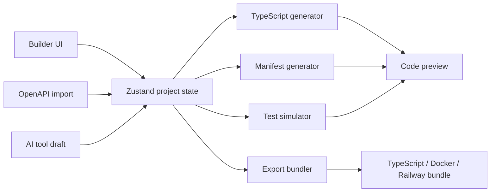

# MCP Server Studio

**Visual builder for Model Context Protocol servers**

Design MCP tools, resources, and prompts on a drag-and-drop canvas, test them in a built-in simulator, and export TypeScript server code with deployment bundles.


## What is this?

MCP Server Studio reduces the boilerplate involved in prototyping Model Context Protocol servers. You can model tools, resources, and prompts visually, inspect the generated manifest and code, exercise definitions in a simulator, and export a runnable TypeScript project.

It is useful for:

- prototyping MCP servers quickly
- learning MCP concepts visually
- converting OpenAPI operations into MCP tool definitions
- testing schemas before implementing business logic
- teaching or demonstrating MCP server structure

## Features

**Visual Canvas** — Drag-and-drop tool, resource, and prompt creation with reusable templates and real-time manifest generation.

**Test Simulator** — Parameter validation, schema checks, and structured test results for tools, resources, and prompts.

**Code Generation** — TypeScript generation with Zod schemas, MCP SDK integration, validation, and `stdio` or HTTP server configurations.

**Export & Deploy** — TypeScript, Docker, and Railway-oriented export bundles with supporting project configuration.

**AI Tool Generator** — Describe a tool in natural language and generate a draft tool definition with parameters and types.

**OpenAPI Import** — Convert operations from OpenAPI/Swagger JSON or YAML into MCP tool definitions.

**Advanced Capabilities** — Model sampling, elicitation, and experimental task configuration on a per-tool basis.

## Quick Start

```bash
git clone https://github.com/forbiddenlink/mcp-server-studio.git
cd mcp-server-studio
pnpm install
pnpm dev
```

Open `http://localhost:3000`.

## Development

```bash
pnpm dev          # Next.js development server
pnpm build        # Production build
pnpm lint         # Biome lint
pnpm test:run     # Vitest single run
pnpm test         # Vitest watch mode
pnpm presubmit    # lint + tests + build
```

Run a single test file:

```bash
pnpm vitest run lib/generators/__tests__/constraints.test.ts
```

## Architecture



The UI owns the editable project model. Importers and assisted drafting populate that model; generators and the simulator consume it as pure or mostly-pure transformations. Export code is produced from the same project state shown in the visual editor, which keeps preview and export behavior aligned.

## Tech Stack

- **Next.js 16** and **React 19**
- **TypeScript 6**
- **React Flow** (`@xyflow/react`) for the canvas
- **Zustand** for editor state
- **Monaco Editor** for code preview
- **Radix / shadcn-style UI components**
- **Tailwind CSS 4**
- **Vitest** for automated tests
- **Biome** for linting and formatting

See [`package.json`](package.json) for the current dependency versions. Keeping exact version numbers out of prose prevents documentation from drifting after dependency updates.

## Project Structure

```text
mcp-server-studio/
├── app/                         # Next.js App Router
├── components/
│   ├── canvas/                  # visual editor and nodes
│   ├── config/                  # configuration panels
│   ├── preview/                 # structure, test, and code views
│   └── ui/                      # shared UI
├── lib/
│   ├── generators/              # manifest/code/export generation
│   ├── importers/               # OpenAPI import
│   ├── simulators/              # definition testing
│   ├── store/                   # editor state
│   ├── templates/               # starter tool definitions
│   ├── utils/                   # sanitization/helpers
│   └── types.ts                 # shared domain model
└── .github/workflows/           # CI
```

## Testing

The automated test suite covers areas including:

- Zod schema generation and constraints
- JSON Schema/manifest generation
- runtime parameter validation
- MCP server code generation
- Docker and Railway export generation
- OpenAPI import parsing
- assisted tool-definition parsing
- simulator behavior
- export bundle composition
- generated-code input sanitization

Do not rely on a hard-coded README test count. Use `pnpm test:run` or CI as the source of truth.

## Roadmap

### Shipped

- visual tool, resource, and prompt builder
- reusable templates
- interactive test simulator
- TypeScript server generation
- Docker and Railway-oriented exports
- assisted tool-definition generation
- OpenAPI import
- sampling, elicitation, and task configuration
- undo/redo and local persistence
- CI

### Next candidates

- example starter projects
- stronger generated-code compatibility tests
- npm/package scaffolding where it reduces user setup
- team/project sharing only if real usage justifies a backend
- explicit MCP specification compatibility/version policy

## Contributing

Contributions are welcome. Before opening a PR:

1. Fork and create a focused branch.
2. Keep generator behavior covered by tests.
3. Run `pnpm presubmit`.
4. Explain user-visible generator or schema changes in the PR description.

Generator bugs should include the smallest project definition that reproduces the incorrect output.

## License

MIT License. See [`LICENSE`](LICENSE).

## Acknowledgments

- [Model Context Protocol](https://modelcontextprotocol.io)
- [React Flow](https://reactflow.dev)
- [Vercel](https://vercel.com)

Built by **Liz Stein**.
